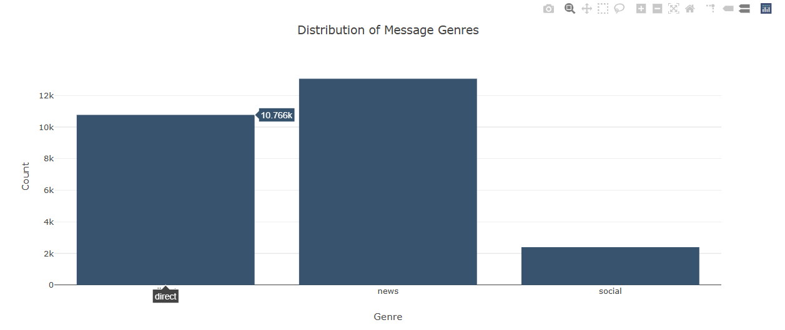
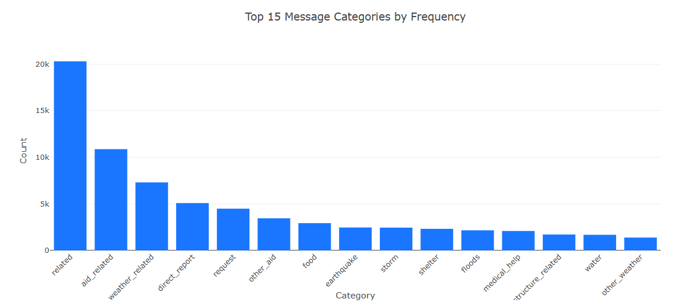
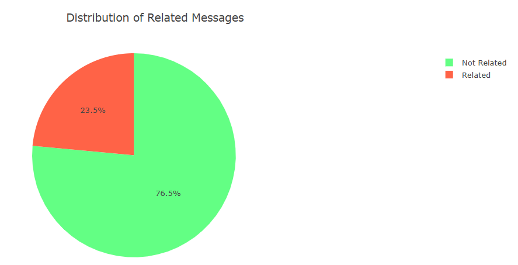
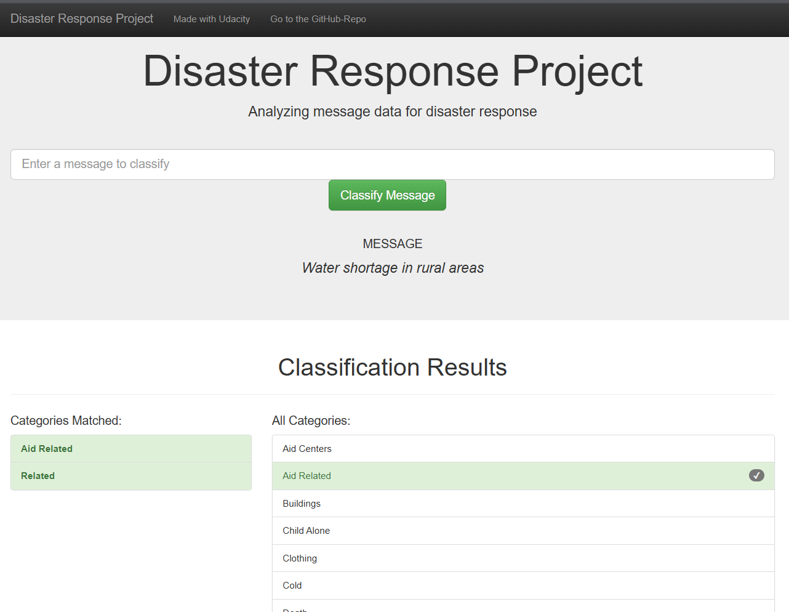
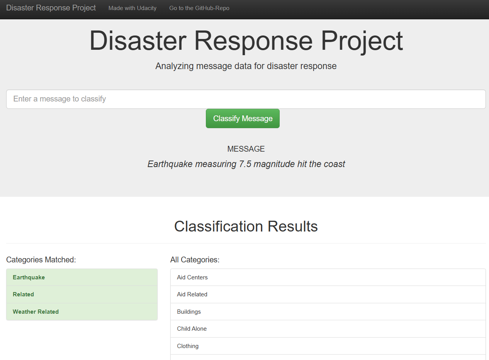
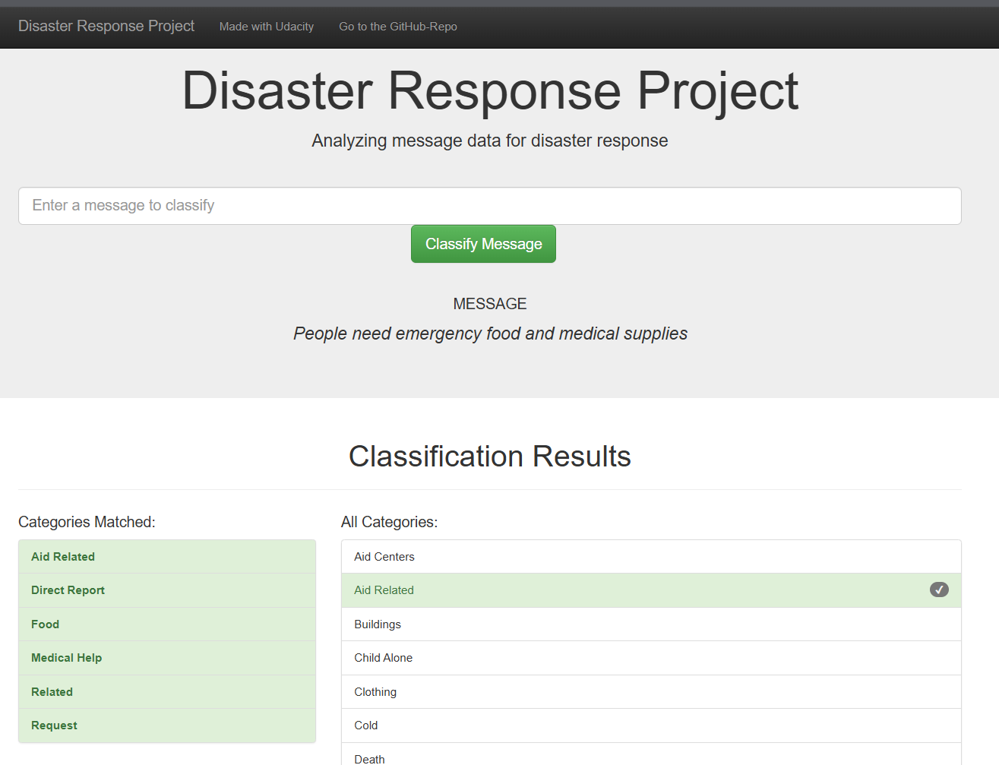

# Disaster Response Pipeline Project

This project implements a machine learning pipeline to classify disaster-related messages into 36 different categories using NLP and MultiOutput classification.

## Project Overview

- **ETL Pipeline** (`data/process_data.py`): Loads disaster messages and categories from CSV files, cleans the data, and stores it in a SQLite database
- **ML Pipeline** (`models/train_classifier.py`): Loads the cleaned data, trains a multi-output text classifier using TF-IDF vectorization and Random Forest, and saves the model
- **Web App** (`app/run.py`): Flask web application with visualizations and a prediction interface

## Installation & Setup

### Prerequisites
- Python 3.8+
- pip

### Dependencies

Install required packages:
```bash
pip install pandas numpy sqlalchemy scikit-learn nltk joblib flask plotly
```

### Running the Pipeline

1. **Run the ETL pipeline** to process raw data and create the database:
   ```bash
   python data/process_data.py data/disaster_messages.csv data/disaster_categories.csv data/DisasterResponse.db
   ```

2. **Run the ML pipeline** to train the classifier and save the model:
   ```bash
   python models/train_classifier.py data/DisasterResponse.db models/classifier.pkl
   ```
   
   ⚠️ **Note:** Model training takes 15-30 minutes and creates a ~1GB pickle file. This file is not stored in GitHub (see `.gitignore`). You must train the model locally.

3. **Run the web app** to access the interactive interface:
   ```bash
   cd app
   python run.py
   ```

4. Open your browser and go to `http://0.0.0.0:3001/`

## Project Structure

```
disaster_response_pipeline_project/
├── data/
│   ├── disaster_messages.csv       # Raw messages data
│   ├── disaster_categories.csv     # Raw categories data
│   ├── process_data.py             # ETL pipeline script
│   └── DisasterResponse.db         # Generated SQLite database (not in GitHub)
├── models/
│   ├── train_classifier.py         # ML pipeline script
│   └── classifier.pkl              # Generated trained model (not in GitHub)
├── app/
│   ├── run.py                      # Flask web app
│   └── templates/
│       ├── master.html             # Main page template with visualizations
│       └── go.html                 # Results page template showing predictions
├── screenshots/                    # Screenshots of web app interface and examples
│   ├── chart1.png                  # Genre distribution visualization
│   ├── chart2.png                  # Top 15 categories visualization
│   ├── chart3.png                  # Related vs. non-related pie chart
│   ├── example1.png                # Example classification 1
│   ├── example2.png                # Example classification 2
│   └── example3.png                # Example classification 3
├── ML Pipeline Preparation.ipynb   # Jupyter notebook for EDA & model development
├── ETL Pipeline Preparation.ipynb  # Jupyter notebook for ETL development
├── README.md                       # Project documentation
└── .gitignore                      # Git ignore file (excludes *.pkl, *.db)
```

## Model Details

- **Vectorizer:** TF-IDF (Term Frequency-Inverse Document Frequency)
- **Classifier:** MultiOutputClassifier with Random Forest (36 output categories)
- **Text Preprocessing:** 
  - Tokenization using NLTK
  - Lemmatization
  - Removal of special characters
  - Stop word removal

## Performance

The model achieves ~95% label-wise accuracy on test data with per-category precision, recall, and F1-scores documented during training output.

## Screenshots & Web App Demo

Once the pipeline is running, the Flask web app provides an interactive interface for exploring disaster message classifications:

### Home Page
- **Genre Distribution Chart**: Bar chart showing message counts across news, social, and direct communication channels

- **Top 15 Categories Chart**: Displays the most frequently occurring disaster types in the training data (e.g., aid_related, water, food)

- **Related vs. Non-Related Pie Chart**: Shows the proportion of messages classified as disaster-related


### Classification Interface
1. Enter a disaster-related message in the text input field
2. Click "Classify" to submit
3. View results on the next page with:
   - **Matched Categories**: Listed with checkmarks (highlighted in green)
   - **Full Category List**: All 36 categories displayed for reference
   - **Model Prediction**: Real-time classification using the trained MultiOutputClassifier

### Example Classifications
- **"Water shortage in rural areas"** → Predicted categories: related, aid_related

- **"Earthquake measuring 7.5 magnitude hit the coast"** → Predicted categories: earthquake, related, weaather related

- **"People need emergency food and medical supplies"** → Predicted categories: food, medical_help, aid_related, direct report, related, request


## Notes

- The trained model file (`classifier.pkl`) is approximately 1GB and is excluded from GitHub. Users must run `train_classifier.py` locally.
- The SQLite database is also excluded from GitHub; run `process_data.py` to generate it.
- For development and testing, see the Jupyter notebooks in the project root.
